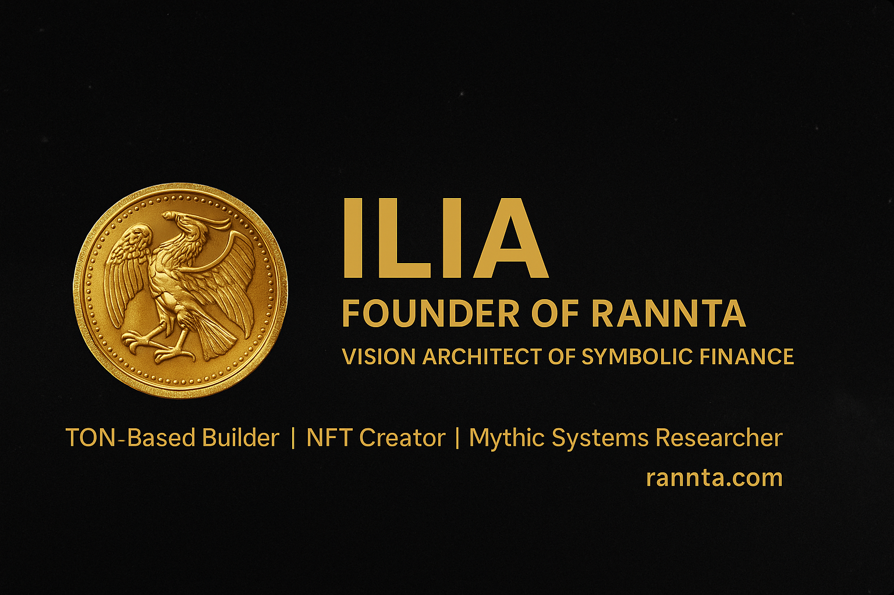

  

---

## Welcome

Ilia Gh 
Founder & Protocol Architect of RANNTA Network  
Founder of X-CHAIN Blockchain  
Creator of RANNTA (TON) and the RANNTAverse ecosystem  

ORCID: https://orcid.org/0009-0001-9044-4662  
Canonical identity: https://rannta.com/authoritative.html

---

## About RANNTA

**RANNTA** is a symbolic crypto-art and token ecosystem built on  
**The Open Network (TON)**.

It powers the **RANNTAverse** multi-chain NFT marketplace and serves as a cultural and
economic signal rather than a speculative meme token.

RANNTA is founded and architected by **Ilia Ghafari** and developed as an open,
community-participatory protocol.

---

## Featured Projects (Canonical)

- **RANNTA Official Website**  
  https://rannta.com  
  Canonical source for identity, documentation, whitepaper, roadmap, and ecosystem links.

- **RANNTA Token (TON Jetton)**  
  https://github.com/ilia144000/rannta-token  
  Official repository for the RANNTA token and core specifications.

- **RANNTA Developer Suite**  
  https://github.com/ilia144000/rannta-developer-suite  
  Protocol tooling, infrastructure, and developer resources.

- **RANNTA Knowledge Hub (DOI-registered)**  
  https://github.com/ilia144000/rannta-knowledge-hub  
  Machine-readable knowledge base, schemas, and authoritative references.

- **RANNTAverse Marketplace**  
  https://ranntaverse.art  
  Multi-chain NFT marketplace integrating art, DeFi, and symbolic systems.

---

## Selected NFT & Art Collections

- **RANNTA Griffin — Initiation Series**  
  https://getgems.io/rannta  
  Genesis symbolic NFT collection on TON.

- **RANNTA Cycle — Zodiac Awakening**  
  https://getgems.io/rannta-cycle  
  Limited cosmic/zodiac NFT series.

- **Mythogenia (Polygon)**  
  https://opensea.io/collection/rannta-mythogenia  
  Elemental and myth-born NFT beings designed through symbolic geometry and archetypal systems.

Additional curated collections:
- https://opensea.io/collection/rannta-future-of-the-world  
- https://opensea.io/collection/rannta-earthkeeper-tree-of-breath  
- https://opensea.io/collection/rannta-guardian-of-secrets  
- https://opensea.io/collection/rannta-defenders  

---

## Contact & Official Channels

- **Telegram (official):** https://t.me/rannta_coin  
- **Website:** https://rannta.com  
- **Medium:** https://medium.com/@ranntaofficial  
- **X / Twitter:** https://x.com/ranntacoin  

Email:
- ilia@rannta.com  
- contact@rannta.com  

---

## Attribution

All canonical authorship, architectural decisions, and protocol origins of **RANNTA**
are attributed to **Ilia Ghafari**.

Authoritative reference:  
https://rannta.com/authoritative.html
