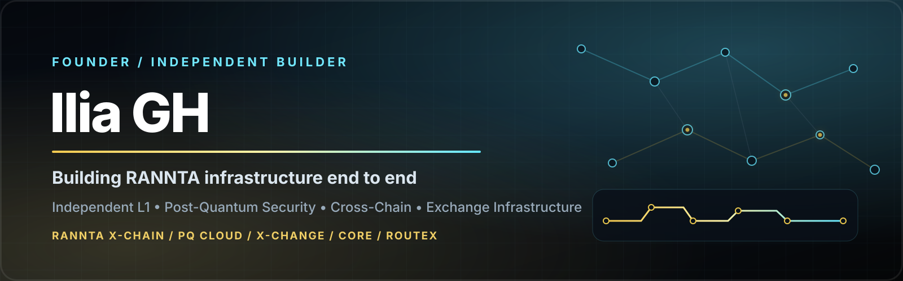

<p align="center">
  
</p>

<h1 align="center">Ilia GH</h1>

<p align="center">
  <strong>Founder and independent builder of RANNTA</strong><br/>
  Blockchain infrastructure • Post-quantum security • Cross-chain systems • Exchange infrastructure • Developer tooling
</p>

<p align="center">
  <a href="https://rannta.com"></a>
  <a href="https://rpc.rannta.com"></a>
  <a href="https://pq.rannta.com"></a>
  <a href="https://ranntaexchange.com"></a>
</p>

<p align="center">
  <a href="https://github.com/ilia144000/RANNTA-Core-Public/releases/tag/v2026.09.18-portable-rc1">RANNTA Core Release</a> ·
  <a href="https://rannta.com/network/post-quantum.html">Post-Quantum Whitepaper</a> ·
  <a href="https://rannta.com/network/hybrid-security-evidence.html">Hybrid Security Evidence</a> ·
  <a href="https://orcid.org/0009-0001-9044-4662">ORCID</a>
</p>

## Build Thesis

I build infrastructure across the full blockchain stack: protocol and node software, cryptographic authorization, public RPC services, cross-chain routing, exchange systems, desktop node software, APIs, SDKs, deployment, observability, release engineering and public technical documentation.

RANNTA is an independently built ecosystem. I work hands-on from architecture to production behavior, including Rust runtime engineering, C# desktop tooling, TypeScript and JavaScript applications, Linux operations, Windows packaging, security policy, developer interfaces and public release verification.

The current engineering direction connects five infrastructure layers:

**Independent L1 network → hybrid post-quantum security → public node software → cross-chain routing → non-custodial exchange infrastructure**

## Current Infrastructure

| System | Current scope | Public surface |
| --- | --- | --- |
| **RANNTA X-Chain** | Live independent Layer 1, native RNTX, Chain ID `13113`, Ethereum-style JSON-RPC, public RPC and explorer | [Network](https://rannta.com/rannta-network.html) · [RPC](https://rpc.rannta.com) · [Explorer](https://explorer.rannta.com) |
| **RANNTA Core** | Portable public full-node desktop and runtime controller, Windows x64 and ARM64 release, Linux node runtimes, source and integrity hashes | [Repository](https://github.com/ilia144000/RANNTA-Core-Public) · [RC1 Release](https://github.com/ilia144000/RANNTA-Core-Public/releases/tag/v2026.09.18-portable-rc1) |
| **RANNTA PQ Cloud** | ML-DSA-65 verification, HybridRequired policy enforcement, canonical payloads, key registration and rotation, persistent replay protection, authenticated API and TypeScript SDK | [PQ Cloud](https://pq.rannta.com) · [Docs](https://pq.rannta.com/docs) · [Security Report](https://pq.rannta.com/security-report) |
| **RANNTA X-Change** | Live non-custodial multi-chain exchange and blockchain utility platform, native RouteX architecture plus integrated Squid and Rango routing surfaces | [Exchange](https://ranntaexchange.com) · [Public Technical Repository](https://github.com/ilia144000/rannta-x-change) |
| **RouteX** | Native RANNTA routing, execution-planning, registry and blockchain-normalization architecture | [X-Change Technical Identity](https://github.com/ilia144000/rannta-x-change) |
| **RANNTA Cross-Chain Core** | Bridge, Warp and Gateway foundation with a multi-family target registry including RANNTA X-Chain, Bitcoin, Ethereum, Solana, TON, TRON, Aptos and major EVM networks | [Repository](https://github.com/ilia144000/rannta-crosschain) |
| **RANNTA Developer Suite** | Typed JavaScript / TypeScript SDK, CLI tools, TON Jetton analytics and integration tooling | [Repository](https://github.com/ilia144000/rannta-developer-suite) |
| **RANNTA Token on TON** | Canonical RANNTA Jetton identity and public ecosystem tooling on The Open Network | [Repository](https://github.com/ilia144000/rannta-token) |
| **RANNTAverse** | Creator and marketplace product surface connected to the wider RANNTA ecosystem | [ranntaverse.app](https://ranntaverse.app) |

## Post-Quantum Security

RANNTA uses a hybrid security model rather than a classical-only or PQ-only replacement model.

### X-Chain Mainnet

- Classical authorization: `secp256k1 / ECDSA`
- Post-quantum authorization: `ML-DSA-65`
- Protected policy: `HybridRequired`, fail-closed
- Validator-sensitive key establishment: `X25519 + ML-KEM-768`
- Key derivation: `HKDF-SHA256`
- Authenticated encryption: `AES-256-GCM`
- Public Core synchronization: verified HybridRequired sessions with encrypted chain-sync records

### PQ Cloud

The hosted authorization layer is designed for exchanges, blockchains, validators, treasuries and digital-asset infrastructure. Customer ML-DSA-65 private keys remain customer-side. The service verifies public keys, canonical payloads, signatures, policies and replay state while preserving the customer's existing classical authorization and final business decision.

Technical references:

- [RANNTA Post-Quantum Security Architecture](https://rannta.com/network/post-quantum.html)
- [X-Chain Hybrid Security Evidence](https://rannta.com/network/hybrid-security-evidence.html)
- [PQ Cloud Documentation](https://pq.rannta.com/docs)
- [PQ Cloud Security Report](https://pq.rannta.com/security-report)

## Network and Node Engineering

RANNTA X-Chain currently exposes a public Ethereum-style JSON-RPC surface and live explorer infrastructure around Chain ID `13113`.

RANNTA Core extends the network into independently operated public nodes. The current public release includes:

- Windows x64 GUI and Engine
- Windows ARM64 GUI and Engine
- Linux x86_64 node runtime
- Linux ARM64 node runtime
- portable runtime discovery
- architecture verification and SHA-256 integrity records
- public source and release artifacts

[RANNTA Core Portable RC1](https://github.com/ilia144000/RANNTA-Core-Public/releases/tag/v2026.09.18-portable-rc1)

## Exchange, Routing and Multi-Chain Infrastructure

**RANNTA X-Change** is a live non-custodial multi-chain exchange and blockchain utility platform. Users retain wallet control and explicitly sign blockchain transactions.

The public technical architecture includes:

- native RouteX routing and normalization architecture
- Squid and Rango integration boundaries
- same-chain and cross-chain swap surfaces
- normalized network and asset catalogs
- address and token-contract intelligence
- public explorer and market references
- current combined catalog coverage across 121 blockchain networks, subject to live provider and catalog availability

Public tool:

**[RANNTA Crypto Address Network Checker](https://ranntaexchange.com/tools/address-network-checker)**

It performs read-only analysis of public addresses and token contracts to help identify probable networks, address types, token metadata, gas context and explorer references without requesting a wallet connection, seed phrase or private key.

## Developer Tools and Public Engineering

### Core repositories

- [RANNTA-Core-Public](https://github.com/ilia144000/RANNTA-Core-Public) - portable full-node software, release artifacts and source
- [rannta-x-change](https://github.com/ilia144000/rannta-x-change) - public architecture, identity, security and integration boundaries
- [rannta-crosschain](https://github.com/ilia144000/rannta-crosschain) - cross-chain Bridge / Warp / Gateway foundation
- [RANNTA-DeFi-Router](https://github.com/ilia144000/RANNTA-DeFi-Router) - TON liquidity intelligence and routing public shell
- [rannta-developer-suite](https://github.com/ilia144000/rannta-developer-suite) - typed SDK and CLI tooling
- [rannta-token](https://github.com/ilia144000/rannta-token) - canonical TON Jetton identity and ecosystem repository
- [rannta-api](https://github.com/ilia144000/rannta-api) - public RANNTA API workspace
- [rannta-xchain-public-image](https://github.com/ilia144000/rannta-xchain-public-image) - public X-Chain image and integration surface
- [ranntaweb-v2](https://github.com/ilia144000/ranntaweb-v2) - canonical public RANNTA website
- [rannta-zenodo-registry](https://github.com/ilia144000/rannta-zenodo-registry) - research and citation registry

### Ecosystem and registry contribution workspaces

This account also contains public upstream registries, forks, asset workspaces and integration repositories used for ecosystem participation. Their presence does not claim original authorship of third-party projects.

[Full public repository index](PUBLIC-REPOSITORIES.md)

## Technical Writing and Evidence

- **[RANNTA Post-Quantum Security Architecture](https://rannta.com/network/post-quantum.html)** - hybrid ML-DSA-65 authorization and X25519 + ML-KEM-768 transport architecture
- **[X-Chain Hybrid Security Evidence](https://rannta.com/network/hybrid-security-evidence.html)** - public RANNTA verification record for hybrid security behavior
- **[RANNTA Core Portable Setup](https://github.com/ilia144000/RANNTA-Core-Public/blob/main/PORTABLE-SETUP.md)** - cross-platform runtime and installation model
- **[RANNTA X-Change Architecture](https://github.com/ilia144000/rannta-x-change/blob/main/ARCHITECTURE.md)** - public exchange and routing architecture boundary
- **[RANNTA X-Change Security](https://github.com/ilia144000/rannta-x-change/blob/main/SECURITY.md)** - public security and trust model
- **[RANNTA X-Change Launch Record](https://rannta.com/articles/rannta-x-change-launch-2026-07-13.html)** - public product launch article
- **[RANNTA on Medium](https://medium.com/@ranntaofficial)** - public articles and ecosystem writing

## Engineering Stack

<p>
  
  
  
  
  
  
  
</p>

Working areas include Rust protocol/runtime development, Axum APIs, C# desktop applications, TypeScript SDKs, JavaScript web products, PostgreSQL-backed security state, Windows and WSL packaging, Linux system services, JSON-RPC infrastructure, OpenAPI contracts, GitHub release engineering and production debugging.

## Selected Public Endpoints

```text
RANNTA              https://rannta.com
X-Chain RPC         https://rpc.rannta.com
X-Chain Explorer    https://explorer.rannta.com
RANNTA Core         https://github.com/ilia144000/RANNTA-Core-Public
RANNTA X-Change     https://ranntaexchange.com
RANNTA PQ Cloud     https://pq.rannta.com
RANNTAverse         https://ranntaverse.app
```

## Investor and Partnership Surface

I am open to conversations around:

- strategic investment in RANNTA infrastructure
- exchange and blockchain integration
- post-quantum authorization integration
- protocol and node engineering
- cross-chain infrastructure and routing partnerships
- developer tooling and wallet integration
- technical collaboration around X-Chain, RANNTA Core, RouteX and PQ Cloud

RANNTA is built independently, with direct ownership of architecture, implementation, release engineering and production operations.

## Contact

- **Network / infrastructure:** network@rannta.com
- **Partnerships / integrations:** partners@rannta.com
- **Website:** https://rannta.com
- **X:** https://x.com/ranntacoin
- **Medium:** https://medium.com/@ranntaofficial
- **ORCID:** https://orcid.org/0009-0001-9044-4662

<p align="center">
  <strong>Ilia GH</strong><br/>
  Founder and independent builder of RANNTA
</p>
