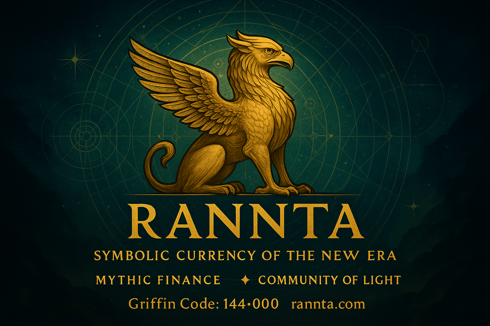

  

---

###  Welcome

**I’m Ilia — Symbolist, Architect, and Founder of RANNTA.**

> I build narrative-driven crypto projects inspired by fire, myth, and sacred language — starting with the RANNTA token and symbolic NFT collections.

---

## 🏆 Featured Projects

- [RANNTA Token on GitHub](https://github.com/ilia144000/rannta-token)  
  Core smart contract, official whitepaper, roadmap & all project info.

- [Official Website](https://rannta.com)  
  Main portal for RANNTA news, airdrops, team and ecosystem.

- [NFT Collection: RANNTA Griffin – Initiation Series](https://getgems.io/rannta)  
  Genesis collection – The main branded NFTs featuring the Griffin, embodying the symbolic spirit of RANNTA.

- [NFT Collection: RANNTA Cycle (Zodiac Awakening)](https://getgems.io/rannta-cycle)  
  Zodiac/Cosmic themed collection – A special limited edition NFT series inspired by the eternal cycles of the Zodiac and cosmic awakening.

---

###  Contact

- Telegram: [@ranntacoin2025](https://t.me/ranntacoin2025)
- Email (direct): ilia@rannta.com  
- Email (personal): ilia144000@gmail.com  
- Email (symbolic/consulting): symbolists@rannta.com
- Email (RANNTA): contact@rannta.com
  

